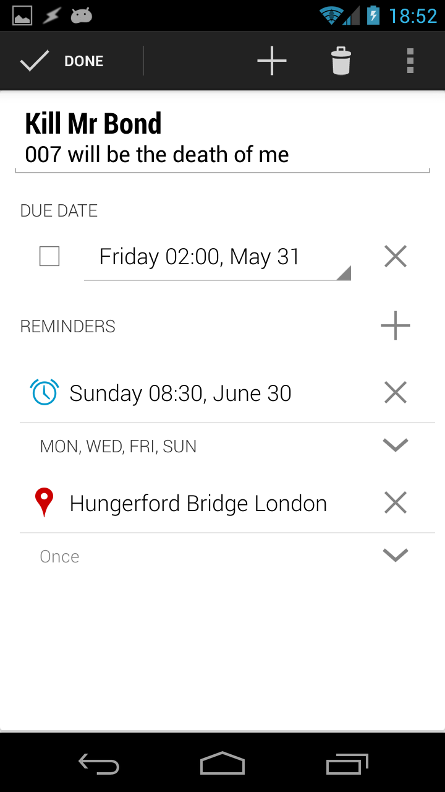

# NoNonsense Notes

<a href="https://flattr.com/submit/auto?user_id=spacecowboy&url=https%3A%2F%2Fgithub.com%2Fspacecowboy%2Fnotepad%2F" target="_blank"></a> [](https://travis-ci.org/spacecowboy/NotePad) [](https://crowdin.com/project/nononsensenotes)

Link to [Google Play](https://play.google.com/store/apps/details?id=com.nononsenseapps.notepad)

Latest updates posted on [http://www.nononsenseapps.com](http://www.nononsenseapps.com)




# Getting sync to work
You need to put your API keys in a file, like the sample here:
https://github.com/spacecowboy/NotePad/blob/master/core/assets/secretkeys.properties.sample

But first you will of course need to get yourself a key. Follow the instructions on this page:
https://developers.google.com/google-apps/tasks/firstapp

Scroll to the section named __Register your project__.

And similar over here https://www.dropbox.com/developers/apps

# Build the project

For free version:

    ./gradlew installFreeDebug

Or with play services and location reminders:

    ./gradlew installPlayDebug

Same as above but including Dropbox at the moment:

    ./gradlew installPlayBetaDebug

# License

```
Copyright (C) 2014 Jonas Kalderstam

This program is free software: you can redistribute it and/or modify
it under the terms of the GNU General Public License as published by
the Free Software Foundation, either version 3 of the License, or
(at your option) any later version.

This program is distributed in the hope that it will be useful,
but WITHOUT ANY WARRANTY; without even the implied warranty of
MERCHANTABILITY or FITNESS FOR A PARTICULAR PURPOSE.  See the
GNU General Public License for more details.

You should have received a copy of the GNU General Public License
along with this program.  If not, see <http://www.gnu.org/licenses/>.
```
