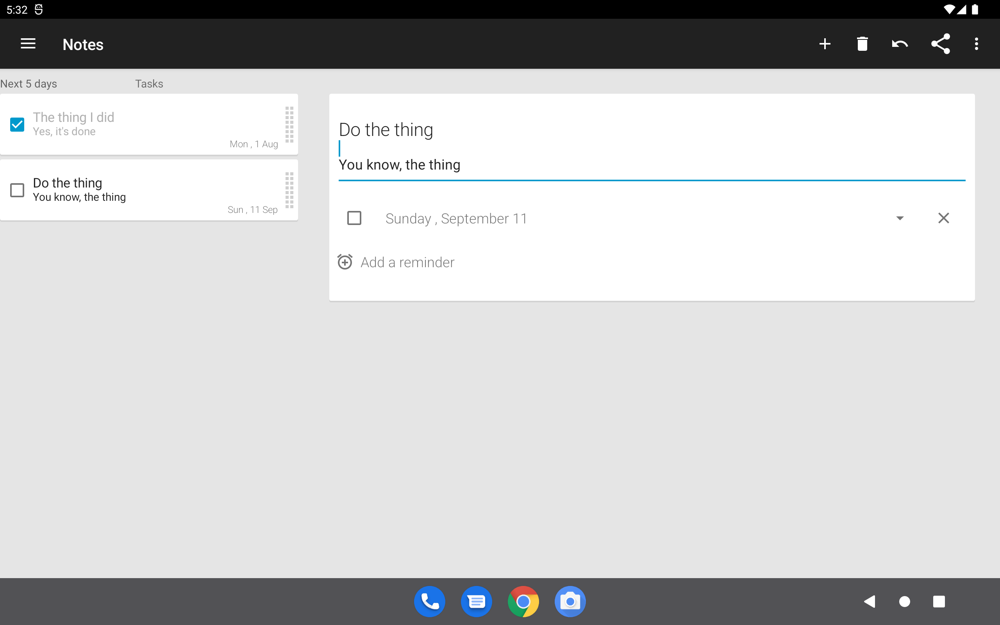

# NoNonsense Notes

[](https://github.com/spacecowboy/NotePad/actions/workflows/android_build.yml)          [](https://github.com/spacecowboy/NotePad/actions/workflows/android_tests.yml)     [](https://hosted.weblate.org/engage/no-nonsense-notes/)

 

 

  

A note taking app for android with reminders, since 2012. Built by @spacecowboy, maintained by @CampelloManuel.

The app is currently being updated, and old versions are still available on f-droid:

[](https://f-droid.org/repository/browse/?fdid=com.nononsenseapps.notepad)

How it looks like:



## Reporting bugs

Please report bugs by creating an [issue here](https://github.com/spacecowboy/NotePad/issues).
I'd very much appreciate it if you could write clear steps to reproduce the bug: use the provided template.

## Build the project

```sh
git clone https://github.com/spacecowboy/NotePad
cd NotePad
./gradlew check
./gradlew installDebug
```

if it does not work, open an issue [here](https://github.com/spacecowboy/NotePad/issues)

## Where did Google Tasks synchronization go ?

See the discussion [here](https://github.com/spacecowboy/NotePad/issues/426)

## Where are the files saved ?

The app can save 2 kinds of files:
* org files, which are used for SD card synchronization. You can choose to save them in a subdirectory of your `Documents` folder, where they will be visible to many apps, including your file manager
* json files, for the backup-restore functionality

Unless otherwise specified, files are saved in a subfolder of `Android/data/` accessible only
to this app. It is still possible to view them by connecting the device to a computer.

## License

```text
Copyright (C) 2014 Jonas Kalderstam

This program is free software: you can redistribute it and/or modify
it under the terms of the GNU General Public License as published by
the Free Software Foundation, either version 3 of the License, or
(at your option) any later version.

This program is distributed in the hope that it will be useful,
but WITHOUT ANY WARRANTY; without even the implied warranty of
MERCHANTABILITY or FITNESS FOR A PARTICULAR PURPOSE.  See the
GNU General Public License for more details.

You should have received a copy of the GNU General Public License
along with this program.  If not, see <http://www.gnu.org/licenses/>.
```

See also [the full license](LICENSE)

## Useful links

* the [FAQ page](app/FAQ.md)
* our [contributions guide](CONTRIBUTING.md)
* the list of [releases](https://github.com/spacecowboy/NotePad/releases)
* our [privacy policy](PRIVACY_POLICY.txt)
* help us translate the app into *your* language, on [weblate](https://hosted.weblate.org/projects/no-nonsense-notes/)

